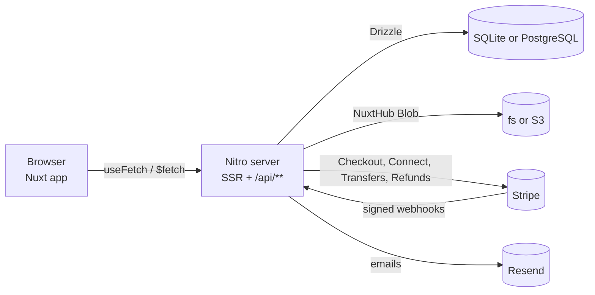

# resell.sh

**A mini Mercado Livre built to learn Nuxt, payments and system design.**

resell.sh is an open-source marketplace where anyone can buy and sell **physical** and **digital** products: one
multi-seller cart, one Stripe Checkout, and a payout to every seller through Stripe Connect. It is lowercase and
terminal green (Enjoei-inspired), and every design decision is written down so you can learn from it.

> **This is a learning project, not production-hardened software for real money.** It runs Stripe in test mode, has
> known gaps documented on purpose (no stock reservation, no automatic retry of failed transfers, no MFA, see
> [docs/security.md](docs/security.md#residual-risks-accepted-for-v1)), and has not been audited. Read the code,
> break it, improve it; don't take real payments with it as is.

## Features

- **Buyers**: search and filter the catalog, multi-seller cart, Stripe Checkout, order tracking, expiring download
  links for digital goods, verified-buyer reviews.
- **Sellers**: a shop at `/my-shop` with products, photos and private files, Stripe Connect Express onboarding, order
  fulfilment (ship, deliver) and full refunds, personal API tokens, and a public REST API documented with
  OpenAPI + Scalar.
- **Admins**: moderation (suspend shops and products), users, transaction logs with CSV export, audit log.
- **Money done carefully**: integer cents, server-side pricing, idempotent Stripe calls and webhooks, and an
  append-only `transaction_logs` ledger for every money event.

## What you can learn here

| Topic | Start with |
|-------|------------|
| System design of a marketplace (requirements, capacity math, ERD, money flow, scaling, failure modes) | [docs/system-design/](docs/system-design/README.md) |
| Stripe Connect with separate charges and transfers, webhooks, refunds | [docs/system-design/05-money-flow.md](docs/system-design/05-money-flow.md) |
| Nuxt 4 full stack: SSR pages and a Nitro API in one app | [docs/architecture.md](docs/architecture.md) |
| One Drizzle data model on SQLite and PostgreSQL | [docs/database.md](docs/database.md) |
| OWASP Top 10:2025 controls in practice | [docs/security.md](docs/security.md) |
| Testing pyramid with a fake Stripe API | [docs/testing.md](docs/testing.md) |

## Tech stack

Bun · Nuxt 4 · Nuxt UI 4 · Tailwind CSS 4 · NuxtHub (Drizzle ORM, SQLite/PostgreSQL, Blob) · nuxt-auth-utils ·
nuxt-security · Zod 4 · Stripe Connect · Resend · Vitest · Playwright · Biome · GitHub Actions · Docker.
Versions and the reason for every non-Nuxt library: [docs/tech-stack.md](docs/tech-stack.md).

## Quick start

Requirements: [Bun 1.4.2+](https://bun.sh). On Windows, [Git for Windows](https://git-scm.com/) (the setup scripts run
in Git Bash).

```bash
git clone https://github.com/AlexGalhardo/nuxtjs-marketplace.git
cd nuxtjs-marketplace
bun run setup:sqlite   # .env, dependencies, SQLite migrations, demo catalog, then starts the app
```

Open http://localhost:3000. The other flavors: `bun run setup:postgres-local` (PostgreSQL installed on your machine)
and `bun run setup:postgres-docker` (PostgreSQL + SeaweedFS S3 in Docker). Each one runs the matching
[`setups/*.sh`](setups/) script for your OS; all of them are idempotent. Details:
[docs/infra-and-setup.md](docs/infra-and-setup.md).

Manual path:

```bash
bun install
cp .env.example .env
bun run db:migrate && bun run db:seed   # SQLite by default, plus a labeled demo catalog
bun run dev                             # http://localhost:3000
```

Payments need Stripe **test mode** keys in `.env` (`NUXT_STRIPE_SECRET_KEY`, `NUXT_PUBLIC_STRIPE_PUBLISHABLE_KEY`,
`NUXT_STRIPE_WEBHOOK_SECRET`) and the Stripe CLI forwarding webhooks:
`stripe listen --forward-to localhost:3000/api/stripe/webhook`. Without `NUXT_RESEND_API_KEY`, emails are printed to
the console. Every variable: [docs/environment-variables.md](docs/environment-variables.md).

To get an admin account, sign up, then run `bun run db:make-admin <email>` and log in again.

## Commands

| Command | What it does |
|---|---|
| `bun run dev` | Development server (`nuxt dev`) |
| `bun run build` / `start` | Production build for Bun / run it |
| `bun run check` / `check:fix` | Biome lint + format |
| `bun run typecheck` | `nuxt typecheck` |
| `bun run test:unit` / `test:coverage` | Unit + Nuxt component tests / unit tests with the 80% coverage gate |
| `bun run test:integration` | API tests against a built server |
| `bun run test:smoke` / `test:e2e` | Playwright |
| `bun run db:migrate` / `db:seed` / `db:reset` | Apply migrations / seed / drop, migrate and seed again |
| `bun run db:make-admin <email>` | Promote an account to admin |
| `bun run release <patch\|minor\|major>` | Turn CHANGELOG `[Unreleased]` into a version, bump, tag (pushing the tag publishes the release) |
| `bun run setup:sqlite` / `setup:postgres-local` / `setup:postgres-docker` | Run the matching `setups/*.sh` for your OS (Git Bash on Windows) |

`bun run dev` is plain `nuxt dev`: `bun --bun nuxt dev` fails SSR resolving `zod` under vite-node (production builds
are unaffected).

## Architecture

One Nuxt 4 application serves the Vue pages and the API (Nitro); there is no separate backend.



The full walkthrough, including the planned Redis cache, BullMQ queues, nginx load balancing and
OpenTelemetry/Grafana observability (PLAN.md Phases 21–22, not built yet), is in
**[docs/system-design/](docs/system-design/README.md)**.

## Testing

| Level | Tool | Location |
|-------|------|----------|
| Unit and component | Vitest (`unit`, `nuxt` projects) | `tests/unit/`, `tests/nuxt/` |
| Integration | Vitest + `@nuxt/test-utils` against a built server, SQLite and PostgreSQL in CI | `tests/integration/` |
| Smoke | Playwright: every page loads with no console errors | `tests/smoke/` |
| End to end | Playwright: signup, sell, buy, refund, admin | `tests/e2e/` |

Tests never call real Stripe: a small fake Stripe API (`tests/integration/helpers/fake-stripe.ts`) stands in. First
Playwright run: `bunx playwright install chromium`. Strategy: [docs/testing.md](docs/testing.md).

## Project structure

```
app/        Vue pages, layouts, components, composables (Nuxt 4 srcDir)
server/     Nitro API (api/), non-API routes (routes/), utils/, db/ (schemas, migrations, seed), plugins/, middleware/
shared/     Zod schemas, types and pure utils used by both app and server
tests/      unit/, nuxt/, integration/, smoke/, e2e/
docs/       guides, plus docs/system-design/ for learners
infra/      Dockerfile and docker-compose stacks
setups/     idempotent setup scripts (Unix and Windows/Git Bash)
scripts/    setup.ts (picks the setup script for your OS), release.ts
```

More: [docs/folder-structure.md](docs/folder-structure.md).

## Deploying

Release tags build `ghcr.io/alexgalhardo/nuxtjs-marketplace:<version>` plus a `-migrate` image;
`infra/docker-compose.yml` runs migrations, then the app, on PostgreSQL. Production needs a TLS reverse proxy that sets
`X-Real-IP` (rate limits and security logs depend on it). Details: [docs/infra-and-setup.md](docs/infra-and-setup.md).

## Documentation

- [docs/system-design/](docs/system-design/README.md): system design guide for learners
- [docs/](docs/README.md): architecture and operational guides (written for AI agents and humans)
- [PLAN.md](PLAN.md): scope, decision log, phase checklist, owner to-dos
- [CHANGELOG.md](CHANGELOG.md) · [CLAUDE.md](CLAUDE.md) / [AGENTS.md](AGENTS.md): AI agent entry point

## Contributing

Contributions, questions and exercise solutions are welcome. Read [CONTRIBUTING.md](CONTRIBUTING.md) (setup, branch
flow, Conventional Commits, changelog, tests) and the [Code of Conduct](CODE_OF_CONDUCT.md). Report vulnerabilities
privately as described in [SECURITY.md](SECURITY.md).

## License

[MIT](LICENSE) © 2026 Alex Galhardo
