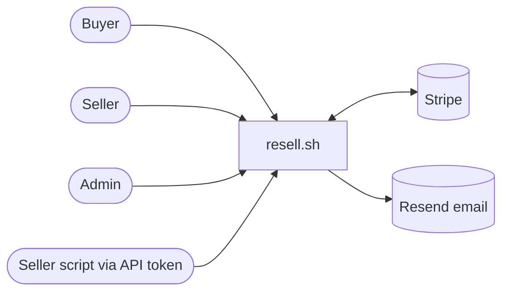

# 1. Requirements

Every system design starts by writing down what the system must do (functional) and how well it must do it
(non-functional). The source of truth here is [PLAN.md §1 and §2](../../PLAN.md).

## Actors

One account can be buyer and seller at the same time (role `user`); `admin` is a separate role
(`users.role`, `server/db/schema.sqlite.ts`).

## Functional requirements

| Area | Requirement | Where it lives |
|------|-------------|----------------|
| Catalog | Search by title, filter by price, kind (physical/digital), product type, shop; sort; paginate | `server/api/products/index.get.ts`, `server/utils/catalog.ts` |
| Cart | One cart with products from many sellers; prices re-read from the DB on every load | `server/utils/cart.ts` |
| Checkout | Pay every seller in **one** Stripe Checkout; shipping address only when something is physical | `server/api/checkout.post.ts` |
| Fulfilment | On payment: mark paid, decrement stock, grant downloads, pay each seller | `server/utils/orders.ts` (`fulfillCheckout`) |
| Digital delivery | Private files, short-lived signed links, 5 downloads / 30 days per grant | `server/utils/downloads.ts`, `server/routes/downloads/[grantId].get.ts` |
| Seller area | Shop, products, images, files, Stripe onboarding, orders, ship/deliver, full refund | `server/api/v1/shop/**`, `app/pages/my-shop/**` |
| Seller API | The same endpoints with scoped Bearer tokens, documented with OpenAPI + Scalar | `server/utils/auth.ts`, `server/api/v1/openapi.json.get.ts` |
| Reviews | Only verified buyers, one review per product | `server/api/reviews.post.ts` |
| Admin | Suspend shops/products, users list, transaction logs with CSV export, audit log | `server/api/admin/**` |
| Ledger | Every money event recorded once, never edited | `server/utils/transactions.ts` |

## Non-functional requirements

| Requirement | Target / decision | Why |
|-------------|-------------------|-----|
| Correctness of money | Integer cents, server-side pricing, idempotent Stripe calls and webhooks, append-only ledger | Losing or double-paying money is the worst bug a marketplace can have |
| Security | OWASP Top 10:2025 baseline ([docs/security.md](../security.md)) | Real users, real payments (in test mode here) |
| Consistency | Order, seller orders and items created in one DB transaction; fulfilment in one transaction | A half-written order can't be paid or refunded correctly |
| Availability | Degrade instead of failing: an email outage never fails a payment webhook | Money already moved; the side effect can wait |
| Simplicity | One Nuxt app (frontend + API), no microservices | One developer, learning project |
| Portability | SQLite for zero-setup dev, PostgreSQL for Docker/production (D5) | Learners can run it without Docker |
| Testability | Unit, integration (SQLite + PostgreSQL), smoke and e2e; fake Stripe in CI | [docs/testing.md](../testing.md) |

## Out of scope (v1)

Multi-currency, carrier rate calculation, subscriptions, buyer/seller chat, OAuth/social login, i18n, mobile apps
(PLAN.md §1). Also deliberately left out: stock reservation, partial refunds, automatic retry of failed transfers.
Each one is a good exercise ([13-exercises.md](13-exercises.md)).

## Questions to ask in an interview version of this problem

- Can one cart contain products from several sellers? (Here: yes, D2. It drives the whole order model.)
- Who owns the refund risk: platform or seller? (Here: the platform pays first, D1.)
- Is stock reserved at checkout or at payment? (Here: at payment, with a known race, see [11-failure-modes.md](11-failure-modes.md).)
- What happens to digital goods after a refund? (Here: download grants expire immediately.)
