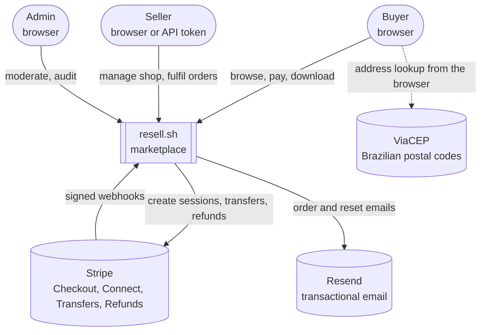
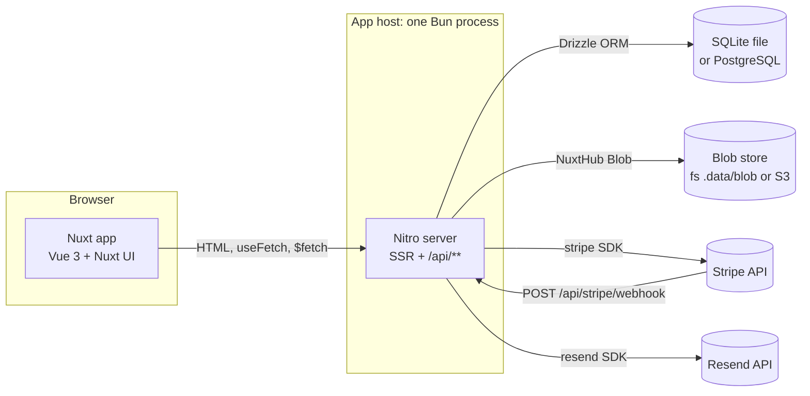
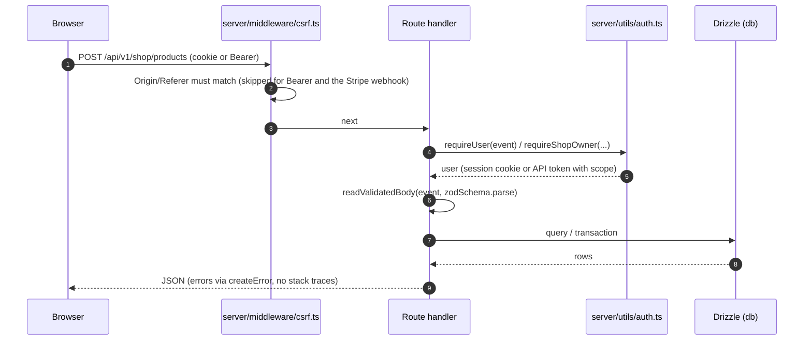
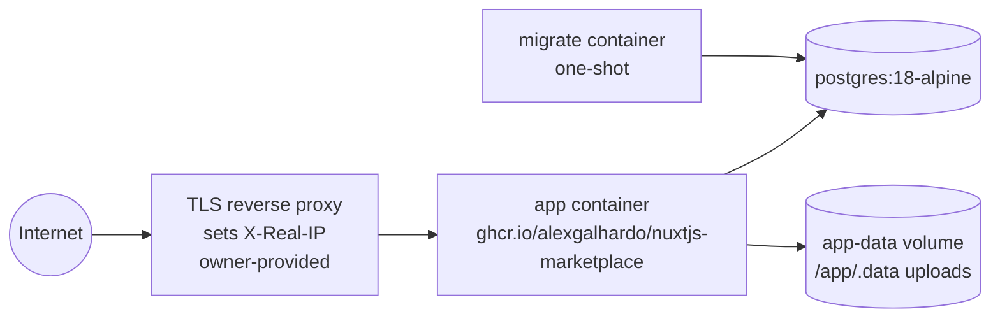

# 3. High-level architecture

resell.sh is a **modular monolith**: one Nuxt 4 application serves the Vue pages (`app/`) and the HTTP API
(`server/`, Nitro). There is no separate backend service. See [docs/architecture.md](../architecture.md) for the
short version.

## C4 level 1: system context

ViaCEP is called by the browser on `/profile` to fill an address from a CEP; the server never calls it.

## C4 level 2: containers

| Container | Technology | Code |
|-----------|------------|------|
| Web app | Nuxt 4 pages, Nuxt UI 4, Tailwind CSS 4 | `app/` |
| API + SSR | Nitro on Bun (`NITRO_PRESET=bun`, `bun .output/server/index.mjs`) | `server/` |
| Database | NuxtHub DB + Drizzle; SQLite (dev) or PostgreSQL (Docker/prod), chosen at build time (D5) | `server/db/` |
| Blob store | NuxtHub Blob: `fs` locally, S3-compatible (SeaweedFS in `infra/docker-compose.dev.yml`) | `server/routes/images/`, `server/routes/downloads/` |
| Payments | Stripe Checkout + Connect Express | `server/utils/stripe.ts`, `server/utils/orders.ts` |
| Email | Resend; logged to the console without `NUXT_RESEND_API_KEY` | `server/utils/mail.ts` |

Shared code that runs on both sides lives in `shared/`: Zod schemas (`shared/schemas/`), types, and pure functions
such as money and fee math (`shared/utils/money.ts`, `shared/utils/pricing.ts`). The same schema validates a form in
the browser and the request body on the server.

## Request lifecycle

1. `nuxt-security` runs first: headers, CSP nonce, request size limits, rate limiting (`nuxt.config.ts`).
2. `server/middleware/csrf.ts` refuses cross-origin cookie-authenticated mutations.
3. The handler authenticates and authorizes with `requireUser`, `requireAdmin`, `requireShopOwner`
   (`server/utils/auth.ts`). There is no auth middleware; each handler asks for what it needs.
4. Input is validated with shared Zod schemas (`readValidatedBody`, `getValidatedQuery`).
5. Data access uses Drizzle directly in the handler or in `server/utils/*` when reused. No repository layer.
6. Errors are `createError({ statusCode, statusMessage })` with safe messages.

## Dogfooding the public API

The seller pages under `/my-shop` call the same `/api/v1/shop/**` endpoints that API token users call (D14). One
code path serves both, so the public API can't silently fall behind the UI. The OpenAPI document is generated from
each handler's `defineRouteMeta()` (`server/api/v1/openapi.json.get.ts`) and rendered with Scalar at
`/my-shop/api-docs`.

## Deployment view (today)

`infra/docker-compose.yml` runs the `migrate` image first, then one `app` container, on PostgreSQL. The reverse proxy
is the owner's job (PLAN.md "Developer actions"); rate limits key on the `X-Real-IP` header it sets
([docs/infra-and-setup.md](../infra-and-setup.md)). Scaling this out is covered in
[09-scaling-and-load-balancing.md](09-scaling-and-load-balancing.md).
