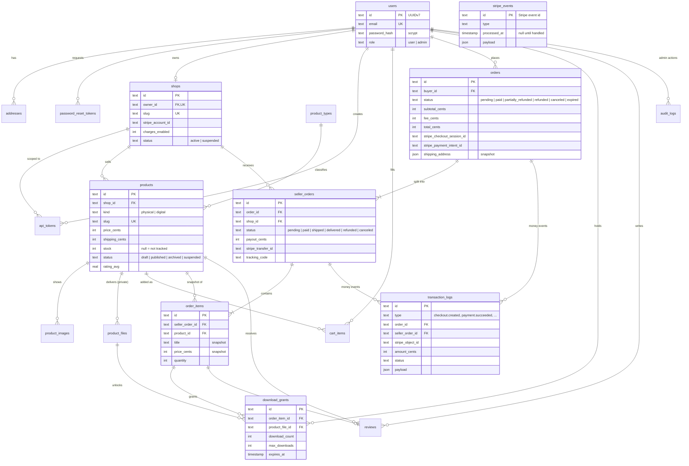

# 4. Data model

19 tables, defined twice: `server/db/schema.sqlite.ts` and `server/db/schema.postgresql.ts` (same names, columns and
nullability, enforced by `tests/unit/db-schema-parity.test.ts`). Details: [docs/database.md](../database.md).

## Entity-relationship diagram

Not drawn to keep the diagram readable: `contact_messages` (standalone) and the full column lists. The complete list
is in [PLAN.md §3.4](../../PLAN.md).

## Design choices worth studying

**Order → seller orders → items (D2).** One buyer payment covers several sellers, but each seller ships, refunds and
gets paid independently. So `orders` holds what the buyer paid, `seller_orders` holds one seller's part (its own
status, payout, transfer and tracking code) and `order_items` hangs off the seller order. The order status is derived
from its seller orders when they change: all refunded → `refunded`, some → `partially_refunded`
(`refundSellerOrder`, `server/utils/orders.ts`).

**Snapshots, not references, for anything historical.** `order_items.title`/`price_cents` and
`orders.shipping_address` are copied at checkout (`server/api/checkout.post.ts`). A seller can rename a product or a
buyer can edit an address later without rewriting history.

**Money is integer cents.** Every amount column is `*_cents` (integer). Floats can't represent 0.10 exactly; integers
can. Fee math: `shared/utils/pricing.ts`; formatting only at the edge: `shared/utils/money.ts`.

**Append-only tables.** `transaction_logs` and `audit_logs` are only ever inserted into. Corrections are new rows,
not updates. This is the ledger idea from accounting, and it makes audits and CSV exports trustworthy.

**Idempotency table.** `stripe_events` uses Stripe's event id as its primary key, so a duplicate delivery can't create
a second row, and `processed_at` says whether the handler finished ([05-money-flow.md](05-money-flow.md)).

**IDs.** Text UUIDv7 (`shared/utils/id.ts`, `Bun.randomUUIDv7()`): globally unique without a database round trip, and
time-ordered, so new rows land at the end of B-tree indexes instead of random pages.

**Enums as text.** Statuses are `text` columns with TypeScript union types (`shared/types/enums.ts`) and Zod
validation, not database enums. Adding a status is a code change, not a migration on both dialects.

**JSON columns.** `text({ mode: 'json' })` on SQLite, `jsonb` on PostgreSQL. Used for loose data that is read whole:
address snapshots, Stripe payloads, audit metadata. This is why the project needs no document database
([12-trade-offs.md](12-trade-offs.md)).

## Indexes

Indexes follow the queries, not the tables. A few from `server/db/schema.sqlite.ts`:

| Index | Query it serves |
|-------|-----------------|
| `products_status_created_idx (status, created_at)` | Public catalog: published products, newest first |
| `products_shop_created_idx (shop_id, created_at)` | A shop's products page |
| `orders_buyer_created_idx (buyer_id, created_at)` | `/orders` for one buyer |
| `orders_checkout_session_idx` | Look up an order from a Stripe session |
| `seller_orders_shop_created_idx (shop_id, created_at)` | `/my-shop/orders` |
| `cart_items_user_product_unique` | One cart line per product, enforced by the database |
| `reviews_product_buyer_unique` | One review per buyer per product, enforced by the database |
| `transaction_logs_order_idx`, `transaction_logs_created_idx` | Admin log filters and date ranges |

Uniqueness rules live in the database, not just in code: two concurrent requests can both pass an `if` check, but only
one can pass a unique index.

## Two dialects, one model

The dialect is chosen at build time (`NUXT_HUB_DB_DIALECT`, D5). SQLite gives learners a zero-setup database;
PostgreSQL is what production runs. CI runs the integration suite against both (`.github/workflows/ci.yml`). The cost:
every schema change is written twice and migrations are generated per dialect (`server/db/migrations/{sqlite,postgresql}/`).
