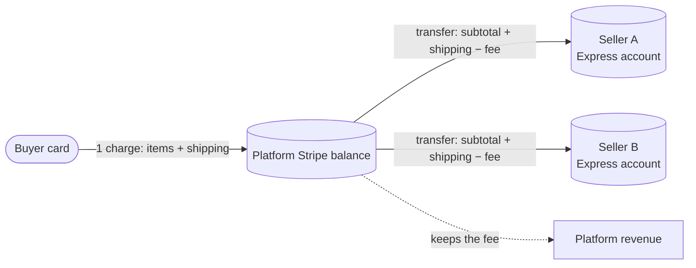
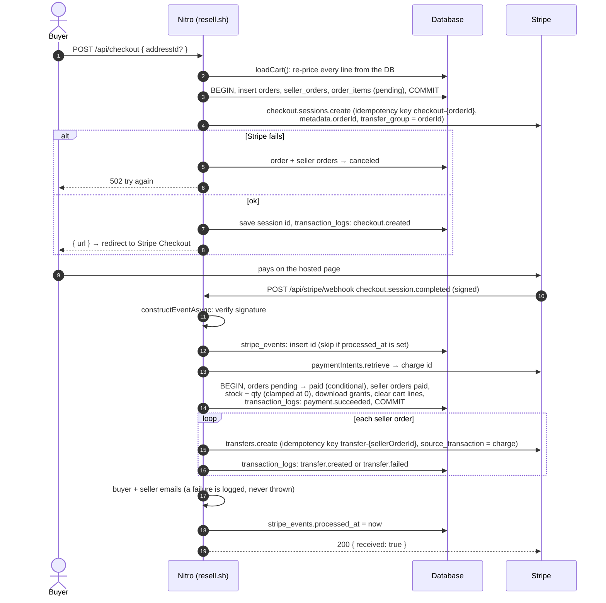
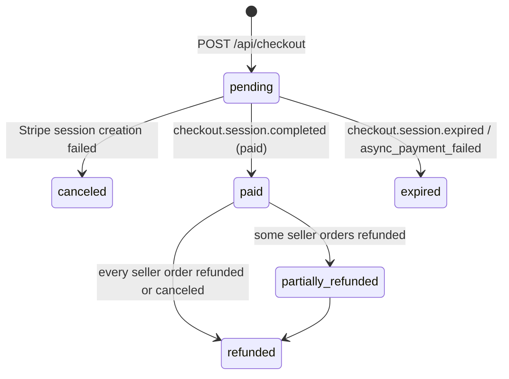
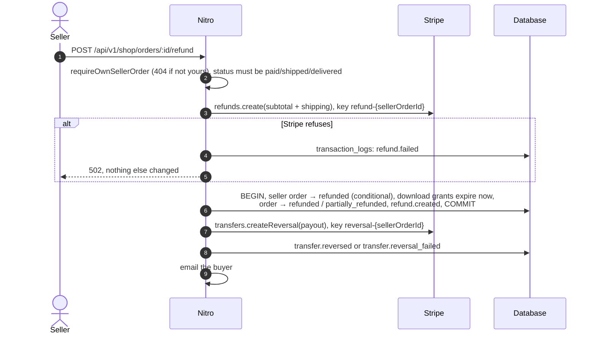

# 5. Money flow

The most important page of this guide. Money code has to survive retries, duplicates, crashes and third-party
outages without paying anyone twice or losing a cent. Operational details: [docs/payments-stripe.md](../payments-stripe.md).

## The model: Stripe Connect, separate charges and transfers (D1)

The buyer pays **the platform** once. The platform then sends each seller their share with a Stripe **Transfer** to
the seller's Connect Express account. All of one order's money movements share `transfer_group = <orderId>`.

Fee per seller order: `round(itemsSubtotalCents × NUXT_PLATFORM_FEE_BPS / 10000)`, 10% by default (D3), never on
shipping (`shared/utils/pricing.ts`).

## Checkout → payment → fulfilment

Code: `server/api/checkout.post.ts`, `server/api/stripe/webhook.post.ts`, `fulfillCheckout` and `transferToSeller` in
`server/utils/orders.ts`.

### Why the order is written before Stripe is called

The order rows exist first, so every Checkout Session points back to a real order through `metadata.orderId`. If the
Stripe call fails, the code marks the order `canceled` instead of leaving a `pending` order that no session can ever
complete (OWASP A10, comment in `server/api/checkout.post.ts`).

### Why the server recomputes everything

The browser sends only `{ addressId }`. Prices, shipping, fees, stock and availability are read from the database on
the server (`loadCart`, `sellerTotals`). A client can't pay $1 for a $100 item by editing a request (OWASP A06).

## Idempotency: four layers

Networks retry. Stripe delivers webhooks **at least once**, sometimes twice, sometimes out of order. A user
double-clicks. Each layer below makes "do it again" harmless:

| Layer | Mechanism | Where |
|-------|-----------|-------|
| Outgoing Stripe calls | Idempotency keys derived from our ids: `checkout-<orderId>`, `transfer-<sellerOrderId>`, `refund-<sellerOrderId>`, `reversal-<sellerOrderId>`. Stripe returns the first result for a repeated key | `server/api/checkout.post.ts`, `server/utils/orders.ts` |
| Incoming webhooks | `stripe_events` keyed by event id; skipped only when `processed_at` is set | `server/api/stripe/webhook.post.ts` |
| State transitions | Conditional updates: `UPDATE orders SET status='paid' WHERE id=? AND status='pending' RETURNING`. Only the first caller gets a row back and does the work | `fulfillCheckout`, `refundSellerOrder` |
| Download counting | One conditional `UPDATE ... WHERE download_count < max_downloads` | `server/routes/downloads/[grantId].get.ts` |

Note the order in the webhook handler: the event is marked processed **after** the handler succeeds. If the handler
throws, Stripe gets a 5xx and retries later; because every step is idempotent, the retry is safe. Marking it processed
first would turn a crash into a silently lost event.

## The ledger: append-only `transaction_logs`

Every money event inserts one row through `logTransaction()` (`server/utils/transactions.ts`): `checkout.created`,
`checkout.expired`, `payment.succeeded`, `transfer.created`, `transfer.failed`, `refund.created`, `refund.failed`,
`transfer.reversed`, `transfer.reversal_failed`, `dispute.created`, `dispute.closed`. Rows are never updated or deleted.

- When the log must agree with a state change, it is written **in the same database transaction**
  (`logTransaction(entry, tx)`): `payment.succeeded` commits or rolls back together with the order becoming paid.
- Failures are logged too. A `transfer.failed` row is how an admin finds a seller who wasn't paid
  (`/admin/transaction-logs`, CSV export).

## Order and seller order states

Each seller order has its own life: `pending → paid → shipped → delivered`, and `paid | shipped | delivered → refunded`
(`server/api/v1/shop/orders/[id]/*.post.ts`).

## Refunds and transfer reversals

Full refunds only, per seller order (D15). The buyer gets back what they paid that seller; the platform also gives up
its fee and pulls the seller's payout back.

The order matters: money moves at Stripe first, then the database records it. If the reversal fails, the buyer is
already refunded and the platform carries the loss until it is settled by hand: that is the liability D1 accepts.

## Other webhook events

| Event | Effect |
|-------|--------|
| `checkout.session.expired`, `checkout.session.async_payment_failed` | Order `expired`, seller orders `canceled`, `checkout.expired` logged (`expireCheckout`) |
| `charge.dispute.created` | `dispute.created` logged against the order (`recordDispute`) |
| `charge.dispute.closed` | `dispute.closed` logged against the order, with the outcome (`won` / `lost`) as its status (`recordDispute`) |
| `charge.refunded` | Refunds made outside the app (Stripe Dashboard) logged as `refund.created` with `payload.source = stripe_dashboard`. Only the part of `amount_refunded` the ledger doesn't already know is logged, so the app's own refunds and re-deliveries add nothing. The order status is left for an admin to reconcile (`recordExternalRefund`) |
| `account.updated` | Shop `charges_enabled` / `payouts_enabled` updated; publishing requires `charges_enabled` (D12) |

Not handled yet: payout failures.

## Known gaps (honest list)

- **No stock reservation.** Stock is checked at checkout and decremented at payment; two buyers can pay for the last
  unit. Stock is clamped at 0 so the seller sees it (`ponytail:` note in `server/api/checkout.post.ts`).
- **Failed transfers are not retried automatically.** They are logged as `transfer.failed` for an admin.
- **Dashboard refunds don't change order status.** `charge.refunded` only adds the ledger row; an admin reconciles
  the order from `/admin/transaction-logs`.

Fixed: a crash between the fulfilment commit and the transfers used to lose the transfers (the retried webhook found
the order `paid` and returned early). `fulfillCheckout` is now re-entrant: on every delivery it pays each `paid`
seller order that has no `transfer.created` / `transfer.failed` log yet, with the same idempotency keys
([08-queues-and-async.md](08-queues-and-async.md#why-seller-transfers-are-not-queued)).

Each of these is an exercise in [13-exercises.md](13-exercises.md).
