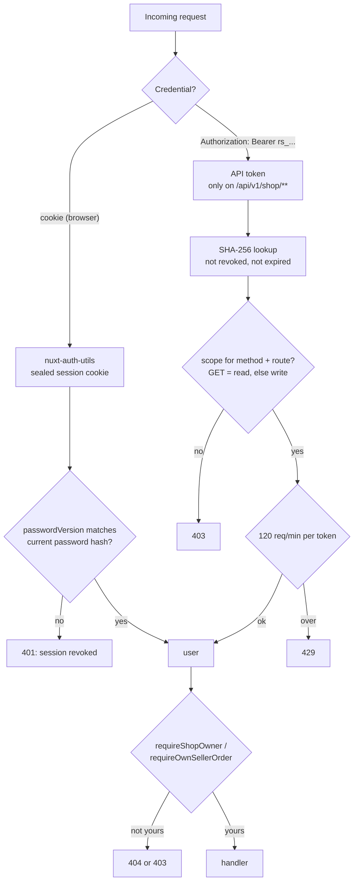
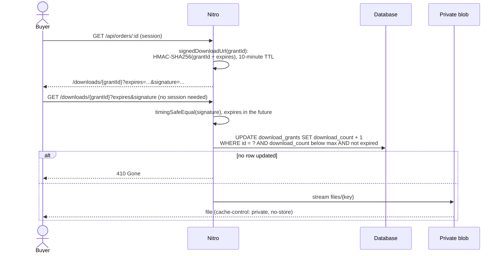

# 6. Auth and security

Baseline: OWASP Top 10:2025, with a control matrix in [PLAN.md §5.1](../../PLAN.md) and the rules in
[docs/security.md](../security.md) and [docs/authentication.md](../authentication.md). This page explains the design
ideas behind them.

## Two ways to authenticate, one authorization path

### Stateless sessions

The session is a **sealed (encrypted + signed) cookie** (`nuxt-auth-utils`, `NUXT_SESSION_PASSWORD`). The server keeps
no session table. That matters for scaling: any replica can read any session, so no sticky sessions and no shared
session store ([09-scaling-and-load-balancing.md](09-scaling-and-load-balancing.md)).

The classic weakness of stateless sessions is revocation: you can't delete a cookie you never stored. The trick used
here (`server/plugins/auth-session.ts`): the session carries `passwordVersion`, a hash of the password hash at login.
On every session fetch, and in `requireUser` for API handlers, it is compared with the current `users.password_hash`
(one primary-key lookup per request: the price of revocation without a session store). Changing or resetting the password
changes the hash, so every other session dies at once, without a session store.

### API tokens

`rs_<prefix>_<secret>`, shown once, stored as SHA-256 (a leaked database doesn't leak usable tokens), scoped
(`shop|products|orders` × `read|write`), expiring and revocable (`server/utils/auth.ts`, `shared/schemas/api-token.ts`).
Fast hash on purpose: tokens are 24 random bytes, so there is nothing to brute-force, unlike passwords, which use scrypt.

### Authorization: 404 or 403?

Another buyer's order and another shop's seller order answer **404** (`GET /api/orders/:id`,
`requireOwnSellerOrder` in `server/utils/orders.ts`): a 403 would confirm that the id exists. The project rule says
the same for every resource (`.claude/rules/server-security.md`), but the older `requireShopOwner` and
`requireProductOwner` helpers (`server/utils/auth.ts`) still answer 403 for an id that exists and belongs to someone
else. UUIDv7 ids are hard to guess, so the leak is small; making it consistent is an exercise
([13-exercises.md](13-exercises.md)).

## Defense in depth

| Threat | Control | Where |
|--------|---------|-------|
| CSRF | `SameSite=Lax` cookie **and** an Origin/Referer check on cookie-authenticated mutations | `server/middleware/csrf.ts` |
| XSS | Vue auto-escaping, no `v-html` with user content, CSP with per-request nonces | `nuxt.config.ts` (`security`) |
| Injection | Drizzle query builder and bound `sql` templates only; Zod on every body/query/param | `shared/schemas/` |
| Brute force | Per-IP rate limits: auth 30/5 min, password change 10/15 min, contact 5/15 min, checkout 20/15 min, global 1000/5 min | `nuxt.config.ts` (`routeRules`) |
| User enumeration | Generic login errors; forgot-password always returns 200 | `server/api/auth/` |
| Forged webhooks | Stripe signature verified with `constructEventAsync` before anything else | `server/api/stripe/webhook.post.ts` |
| Price tampering | Server re-prices the cart; the client sends no amounts | `server/utils/cart.ts` |
| Paid file theft | Private `files/` blob prefix never routed; image route refuses `..`, `.`, `\` and leftover `%` | `server/routes/images/[...pathname].get.ts` |
| Leaked secrets | Zod-validated `runtimeConfig`, startup aborts on missing production secrets (`NUXT_STRICT_ENV`) | `server/utils/env.ts` |
| Silent attacks | Security events as JSON lines without PII; admin actions in `audit_logs` | `server/utils/security-log.ts`, `server/utils/audit.ts` |

## Signed download links

Digital files must reach exactly one buyer. Two layers:

The short-lived HMAC stops a copied link from being reused later; the grant row carries the real limits (5 downloads,
30 days), and a refund expires it immediately. Code: `server/utils/downloads.ts`,
`server/routes/downloads/[grantId].get.ts`.

## The reverse proxy is part of the security design

Rate limits and security logs key on `X-Real-IP` (`security.rateLimiter.ipHeader` in `nuxt.config.ts`), because
`X-Forwarded-For` can be spoofed by the client and Nitro's Bun server doesn't expose the socket address. The TLS proxy
in front must overwrite that header. Without it, every client shares one bucket
([docs/infra-and-setup.md](../infra-and-setup.md)).

## Accepted residual risks

No MFA, `style-src 'unsafe-inline'` for Nuxt UI, per-process token rate limit, no stock reservation. The full list
lives in [docs/security.md](../security.md#residual-risks-accepted-for-v1).
