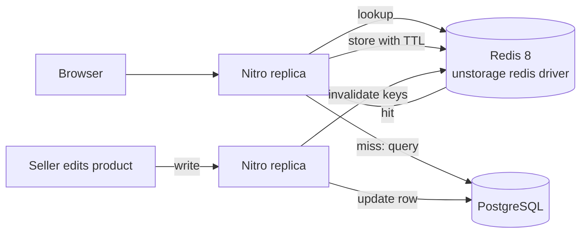

# 7. Caching

Caching trades freshness for speed. The questions are always the same: what is read often and changes rarely, who
may see a stale copy, and how does the copy get invalidated?

## What exists today: HTTP caching only

There is no server-side cache yet. Every catalog request runs its SQL. What the code does cache is at the HTTP layer:

| Response | Header | Why it is safe | Where |
|----------|--------|----------------|-------|
| Uploaded images `/images/**` | `public, max-age=31536000, immutable` | Blob keys carry a random suffix and are never overwritten; a new upload gets a new URL | `server/routes/images/[...pathname].get.ts` |
| `GET /api/product-types` | `public, max-age=3600` | Fixed list, only changed by the seed script (D13) | `nuxt.config.ts` (`routeRules`) |
| Downloads `/downloads/**` | `private, no-store` | Paid files must never sit in a shared cache | `server/routes/downloads/[grantId].get.ts` |
| CSV export | `no-store` | Admin data | `server/api/admin/transaction-logs/export.get.ts` |

The image rule shows the most useful caching trick: **make the URL change when the content changes** (content-addressed
or random keys). Then the cache never needs invalidating, and a browser or CDN can keep the file for a year.

## Planned: Redis cache (Phase 21)

> **Planned (Phase 21).** Described design only, not in the code. See PLAN.md Phase 21.

The plan, as written in PLAN.md:

- **Storage**: Redis 8 in docker-compose, wired as Nitro's `storage.cache` through unstorage's built-in redis driver
  (`ioredis`), so all replicas share one cache.
- **What to cache**: the hot public reads, which are the same for every visitor: the catalog (`GET /api/products`),
  product pages, shop pages and product types, using `defineCachedEventHandler`.
- **Invalidation on write**: when a seller edits a product, or an admin suspends a shop, the matching keys are
  deleted. Short TTLs bound the damage of a missed invalidation.
- **Degrade, don't fail**: with Redis down or `REDIS_URL` unset, requests go straight to the database (no cache).

### Design questions to think about

- **Cache key.** The catalog has many query combinations (`q`, `kind`, `type`, `minPrice`, `sort`, `page`…). Caching
  every combination wastes memory on the long tail; caching only the default first page catches most traffic.
- **What must never be cached in a shared cache.** Anything per user: the cart (`server/utils/cart.ts` re-prices on
  every read on purpose), orders, sessions, download links. A wrong cache key here leaks one user's data to another.
- **Stock and price staleness.** A cached product page may show a stale price or stock. That is acceptable because
  checkout re-prices everything from the database (`loadCart`); the cache serves browsing, never money decisions.
- **Thundering herd.** When a hot key expires on Black Friday, many requests miss at once and all hit the database.
  Stale-while-revalidate (serve the old value, refresh in the background) avoids it.

### Why a CDN comes first

The capacity estimates ([02-capacity-estimates.md](02-capacity-estimates.md)) show images, not SQL, are the
bottleneck. Because image URLs are already immutable, a CDN in front of `/images/**` is the cheapest big win, even
before Redis.
