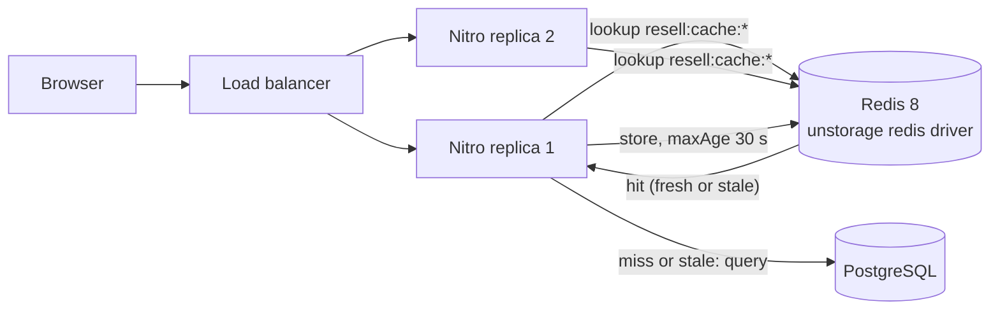

# 7. Caching

Caching trades freshness for speed. The questions are always the same: what is read often and changes rarely, who
may see a stale copy, and how does the copy get invalidated?

## HTTP caching

What the code caches at the HTTP layer:

| Response | Header | Why it is safe | Where |
|----------|--------|----------------|-------|
| Uploaded images `/images/**` | `public, max-age=31536000, immutable` | Blob keys carry a random suffix and are never overwritten; a new upload gets a new URL | `server/routes/images/[...pathname].get.ts` |
| `GET /api/product-types` | `public, max-age=3600` | Fixed list, only changed by the seed script (D13) | `nuxt.config.ts` (`routeRules`) |
| Downloads `/downloads/**` | `private, no-store` | Paid files must never sit in a shared cache | `server/routes/downloads/[grantId].get.ts` |
| CSV export | `no-store` | Admin data | `server/api/admin/transaction-logs/export.get.ts` |

The image rule shows the most useful caching trick: **make the URL change when the content changes** (content-addressed
or random keys). Then the cache never needs invalidating, and a browser or CDN can keep the file for a year.

## Server cache: Redis

**What is cached.** Four public reads that are the same for every visitor, each wrapped in Nitro's
`defineCachedEventHandler` with the shared `catalogCache` options (`server/utils/redis.ts`):

| Handler | Route |
|---------|-------|
| `server/api/products/index.get.ts` | `GET /api/products` (catalog, every query combination is its own key) |
| `server/api/products/[slug].get.ts` | `GET /api/products/:slug` |
| `server/api/shops/[slug].get.ts` | `GET /api/shops/:slug` |
| `server/api/product-types.get.ts` | `GET /api/product-types` |

**Options.** `maxAge: 30` seconds and `swr: true`: after 30 s the stale value is still served while one refresh
runs in the background, so a hot key expiring on Black Friday doesn't send a burst of identical queries to the
database (thundering herd).

**Where it lives.** `server/plugins/redis.ts` mounts Nitro's `cache` storage on unstorage's redis driver (prefix
`resell:cache`) at **run time**, not in `nuxt.config.ts`, so `REDIS_URL` comes from the environment the server
starts in instead of being baked into the build. The same plugin mounts `#rate-limiter-storage` (nuxt-security's
limiter, prefix `resell:ratelimit`), so every replica counts against the same per-IP buckets
([09-scaling-and-load-balancing.md](09-scaling-and-load-balancing.md)). `preConnect: true` opens the connection
at boot, so the first request doesn't fail while Redis is still connecting.

**Without Redis.** `shouldBypassCache` returns true when `REDIS_URL` is unset (dev, tests, a single instance): the
cache is skipped entirely. A per-process memory cache would let two replicas show two different catalogs, which is
more confusing than no cache.

**Redis down.** Each mount is wrapped in a small fail-open driver: a failed Redis call logs `[redis] ... failed,
using memory` and uses this process's memory instead. This exists because nuxt-security's limiter doesn't catch
storage errors, so without it a Redis outage would turn every request into a 500. While Redis is down, rate limits
are per replica and the cache is per replica; both heal when Redis is back. The client fails fast while disconnected
(`enableOfflineQueue: false`, `maxRetriesPerRequest: 1`), so an outage costs a request milliseconds.

### No explicit invalidation: bounded staleness

Nothing deletes cache keys when a seller edits a product or an admin suspends a shop. The trade-off:

- **Cost**: for up to ~30 s (plus one background refresh) a visitor may see the old price, the old stock or a
  product that was just suspended.
- **Why it is acceptable**: the cache serves browsing, never money decisions. The cart and checkout re-price every
  line from the database (`loadCart`, `server/utils/cart.ts`), and checkout re-checks stock and visibility, so a
  stale page can't charge a wrong amount or sell a hidden product.
- **What it saves**: no list of keys to track per write, no missed-invalidation bugs (the catalog has many query
  combinations, so "which keys show this product?" has no cheap answer).

Invalidation by tag is the next step if 30 s ever becomes too long ([13-exercises.md](13-exercises.md)).

### Design questions to think about

- **Cache key.** The catalog has many query combinations (`q`, `kind`, `type`, `minPrice`, `sort`, `page`…) and
  today each one is its own key. That wastes memory on the long tail; caching only the default first pages would
  catch most traffic with far fewer keys. A 30 s `maxAge` keeps the long tail from piling up for long.
- **What must never be cached in a shared cache.** Anything per user: the cart (`server/utils/cart.ts` re-prices on
  every read on purpose), orders, sessions, download links. A wrong cache key here leaks one user's data to another.
  That is why only handlers with no session lookup use `catalogCache`.
- **TTL vs invalidation.** Would a 5 s `maxAge` be enough on Black Friday? What would a tag per shop or product cost
  on every write path?

### Why a CDN comes first

The capacity estimates ([02-capacity-estimates.md](02-capacity-estimates.md)) show images, not SQL, are the
bottleneck. Because image URLs are already immutable, a CDN in front of `/images/**` is the cheapest big win, even
before Redis.
