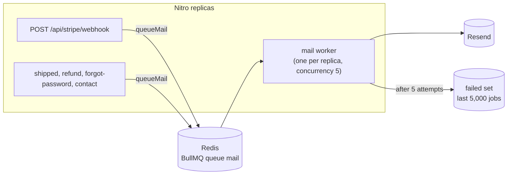

# 8. Queues and async work

A queue moves work that the user doesn't need to wait for out of the request, and gives that work retries.

## The mail queue (BullMQ on Redis)

Every email goes through `queueMail()` (`server/utils/queue.ts`):

| Email | Enqueued by |
|-------|-------------|
| Order paid (buyer + each seller) | The Stripe webhook (`sendOrderEmails`, `server/utils/orders.ts`) |
| Shipped, refunded | The seller's request (`notifyBuyer`) |
| Password reset | `POST /api/auth/forgot-password` (not awaited) |
| Contact form | `POST /api/contact` (the message is stored first) |

- **Retries**: `attempts: 5` with `backoff: { type: 'exponential', delay: 5_000 }` (5 s, 10 s, 20 s, 40 s). A job
  that still fails stays in BullMQ's failed set (`removeOnFail: 5_000`); completed jobs are trimmed to the last 1,000.
- **Worker per replica**: `server/plugins/queue-worker.ts` starts a BullMQ `Worker` in every app replica, on its own
  Redis connection (workers block on Redis and BullMQ requires `maxRetriesPerRequest: null`). BullMQ hands each job
  to exactly one worker. `QUEUE_WORKER=false` makes a replica web-only, the first step if workers ever move to their
  own service.
- **Inline fallback**: without `REDIS_URL` (dev, tests) `queueMail` calls `sendMail` directly. If enqueueing fails
  (Redis down), it also sends inline rather than lose the mail.

What this bought:

1. **Latency and coupling.** A Resend outage no longer slows or fails a webhook or a checkout follow-up: the request
   only writes a job to Redis.
2. **Retries.** A transient mail failure heals by itself instead of needing a human.
3. **No user enumeration through timing.** `forgot-password` doesn't await the mail and never lets a mail error reach
   the response, so known and unknown emails answer the same way ([06-auth-and-security.md](06-auth-and-security.md)).

## Why seller transfers are not queued

Transfers still run inside the webhook (`fulfillCheckout` → `transferToSeller`). The risk was the **crash window**:
if the process died after the fulfilment transaction committed but before the transfers ran, the retried webhook saw
the order already `paid` and returned early, so the seller was never paid.

A queue doesn't fix that by itself: commit, then enqueue, and a crash between the two still loses the job. It was
fixed instead by making `fulfillCheckout` **re-entrant** (`server/utils/orders.ts`):

- The `pending → paid` update is conditional, so only the first delivery fulfils (stock, cart, `payment.succeeded`).
- The transfer step runs on **every** delivery: it loads the order's `transfer.created` / `transfer.failed` logs and
  pays each seller order that is `paid` and has no transfer log yet.
- Every transfer carries the Stripe idempotency key `transfer-<sellerOrderId>`, so even a crash after Stripe answered
  but before the log row was written returns the same transfer on the next try.
- The webhook only marks the event processed after `fulfillCheckout` returns, so a crash leaves it unprocessed and
  Stripe's retry runs the transfer step again.

Why this beats an outbox here: Stripe already **is** the durable, retrying delivery mechanism (it redelivers an
unacknowledged event for up to three days), and `transaction_logs` already records what ran. Re-entrancy reuses
both, adds no table, no relay process and no new failure mode. An outbox earns its keep when the trigger has no
retrying source of its own.

### Exercise: the transactional outbox

Write a "pay seller order X" row in the **same database transaction** that marks the order paid. A relay process
reads outbox rows and pushes them to a queue. The job can't be lost, because it exists exactly when the payment does.
Try it for a trigger Stripe doesn't redeliver (an admin action, a scheduled payout), and keep jobs idempotent: a job
can run twice (the worker crashed after Stripe answered, before acking), which the idempotency key already covers.

At-least-once delivery + idempotent consumers = effectively-once. The same idea protects the webhook
([05-money-flow.md](05-money-flow.md#idempotency-four-layers)).

### What should stay synchronous

The Stripe Checkout Session creation stays inline: the buyer needs its URL to continue. Anything whose result the user
must see right now belongs in the request; anything that only must happen *eventually* belongs in a queue.
