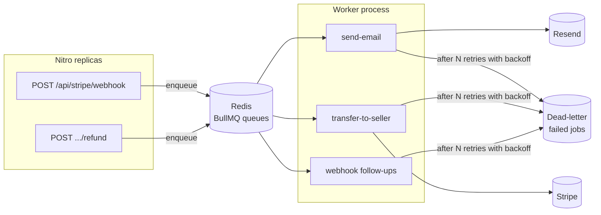

# 8. Queues and async work

A queue moves work that the user doesn't need to wait for out of the request, and gives that work retries.

## What exists today: everything inline

There is no queue yet. Side effects run inside the request that triggers them:

| Side effect | Runs inside | If it fails today |
|-------------|-------------|-------------------|
| Seller transfers | The Stripe webhook request (`fulfillCheckout` → `transferToSeller`, `server/utils/orders.ts`) | Logged as `transfer.failed`, not retried |
| Order emails (buyer + each seller) | The same webhook request (`sendOrderEmails`) | Logged to the console, never retried; the webhook still succeeds |
| Refund email, shipped email | The seller's request (`notifyBuyer`) | Same |
| Password reset email | `POST /api/auth/forgot-password` | Request fails |
| Contact email | `POST /api/contact` (the message is stored first) | Request fails, row kept |

This works at today's scale and keeps the code simple: one process, no worker, no broker. The costs:

1. **Latency on the webhook.** Stripe waits while we make 1 + N transfer calls and send N + 1 emails sequentially.
2. **No retries.** A failed transfer or email needs a human.
3. **A crash window.** If the process dies after the fulfilment transaction commits but before the transfers run, the
   retried webhook sees the order already `paid` and skips the transfers ([05-money-flow.md](05-money-flow.md#known-gaps-honest-list)).

## Planned: BullMQ on Redis (Phase 21)

> **Planned (Phase 21).** Described design only, not in the code. See PLAN.md Phase 21.

The plan, as written in PLAN.md:

- **Jobs**: emails, seller transfer retries, webhook follow-ups, off the request path.
- **Worker**: a separate process consuming the queues, scaled independently from the web replicas.
- **Retries with exponential backoff**, then a **dead-letter** state an admin can inspect and replay.
- **Inline fallback** when `REDIS_URL` is unset (dev and tests): jobs run immediately in-process, as today.

### Making it correct, not just async

A queue doesn't fix the crash window by itself. If the code commits the order and then enqueues the transfer job, a
crash between the two still loses the job. Two standard answers:

- **Transactional outbox.** Write a "pay seller order X" row in the **same database transaction** that marks the order
  paid. A relay process reads outbox rows and pushes them to the queue. The job can't be lost, because it exists
  exactly when the payment does.
- **Idempotent jobs.** A job can run twice (the worker crashed after Stripe answered, before acking). That is already
  covered: transfers use the idempotency key `transfer-<sellerOrderId>`, so a repeat returns the first transfer.

At-least-once delivery + idempotent consumers = effectively-once. The same idea already protects the webhook
([05-money-flow.md](05-money-flow.md#idempotency-four-layers)).

### What should stay synchronous

The Stripe Checkout Session creation stays inline: the buyer needs its URL to continue. Anything whose result the user
must see right now belongs in the request; anything that only must happen *eventually* belongs in a queue.
