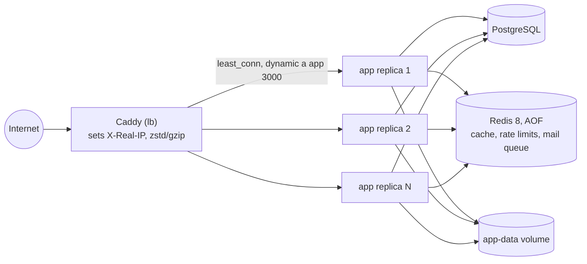

# 9. Load balancing and horizontal scaling

Vertical scaling buys a bigger machine. Horizontal scaling runs more copies of the app behind a load balancer. It only
works if the copies are **stateless**: any replica can serve any request because the state lives elsewhere.

## The state checklist

Before running a second replica, check every piece of state the process holds:

| State | Where it lives | Shared across replicas? | How |
|-------|----------------|-------------------------|-----|
| User sessions | Sealed cookie in the browser (`nuxt-auth-utils`) | Yes, nothing on the server | Every replica has `NUXT_SESSION_PASSWORD` |
| Database | PostgreSQL (`DATABASE_URL`) | Yes | SQLite would not work: a local file |
| Uploads and digital files | S3 bucket (Railway) or the `app-data` volume (compose) | Yes | Compose mounts one named volume into every replica ([docs/infra-and-setup.md](../infra-and-setup.md#uploads-in-the-docker-image)) |
| Global and per-route rate limits | nuxt-security limiter on `#rate-limiter-storage` | Yes, with Redis | `server/plugins/redis.ts` mounts it on Redis; without Redis each replica allows the full limit |
| Per-token API limit (120/min) | Redis counter, memory `Map` fallback | Yes, with Redis | Atomic `MULTI` of `INCR` + `PEXPIRE ... NX` + `PTTL` per window (`server/utils/auth.ts`) |
| Response cache | Nitro `cache` storage on Redis | Yes | Bypassed without Redis ([07-caching.md](07-caching.md)) |
| Mail jobs | BullMQ queue on Redis | Yes | Each replica runs a worker; BullMQ hands a job to exactly one ([08-queues-and-async.md](08-queues-and-async.md)) |
| Stripe webhook idempotency | `stripe_events` table | Yes | Two replicas receiving the same event race safely (conditional updates + idempotency keys) |

Sessions and money were replica-safe by design from the start; Redis made rate limits and the cache shared too.

**Redis down.** Every Redis use fails open: the cache and the nuxt-security buckets fall back to process memory
(the fail-open driver in `server/plugins/redis.ts`), the token limit falls back to its `Map`, and mail is sent
inline when enqueueing fails. Limits become per replica (N replicas allow N × the limit) until Redis is back, but no
request fails because of it.

## Self-hosted: Caddy in front of N replicas

What `infra/docker-compose.yml` and `infra/caddy/Caddyfile` do:

- **2 replicas by default** (`deploy.replicas: 2`); `docker compose up -d --scale app=N` changes the count.
- **DNS discovery.** `reverse_proxy { dynamic a app 3000 { refresh 10s } }`: Caddy re-resolves Docker's DNS name
  `app` every 10 s, so scaled replicas join (and removed ones leave) without restarting Caddy.
- **`lb_policy least_conn`**: a new request goes to the replica with the fewest open requests, which handles slow
  requests (a webhook making Stripe calls) better than plain round robin.
- **Passive health.** `lb_try_duration 5s` retries a request on another replica for up to 5 s when one fails to
  connect; `fail_duration 10s` keeps a failed replica out of rotation for 10 s.
- **`header_up X-Real-IP {remote_host}`**: overwrites the header with the peer address. The rate limiter keys on it
  (`ipHeader: 'x-real-ip'` in `nuxt.config.ts`) because `X-Forwarded-For` is client-spoofable.
- **Redis 8** with `--appendonly yes` (AOF on the `redis-data` volume), so queued mail survives a Redis restart.
- Caddy listens on `:80` (published as `3000`) with `auto_https off`; with a real domain it gets TLS certificates by
  itself.
- `stripe-cli` forwards webhooks to `lb:80`, so local webhooks are balanced like real ones.

## Production: Railway

Railway runs the `app` service with **2 replicas behind Railway's edge**, which terminates TLS, balances the
replicas and sets `X-Real-IP` (there is no Caddy in production, PLAN.md D25). Next to it: the `Postgres` service, a
`Redis` service for `REDIS_URL`, and the `uploads` S3 bucket. A deploy only takes traffic once `/api/health`
answers, and a failing health check keeps the previous deployment serving
([docs/infra-and-setup.md](../infra-and-setup.md#production-on-railway)).

### Things to get right

- **No sticky sessions needed.** Because the session is a cookie, any balancing policy works. That is a direct payoff of
  the stateless session design ([06-auth-and-security.md](06-auth-and-security.md#stateless-sessions)).
- **Liveness vs readiness.** `/api/health` runs a one-row query and answers 503 when the database is unreachable
  (`server/api/health.get.ts`), so it is a readiness check: Docker's `HEALTHCHECK` and Railway's deploy check stop
  trusting a replica that lost its database. It still exposes no version or config details.
- **Migrations with N replicas.** Today a one-shot `migrate` container runs before `app`. With rolling deploys, old and
  new code run against the same schema for a while, so migrations must be backward-compatible (add a column, deploy,
  then remove the old one in a later release).
- **Connection budget.** N replicas × pool size ≤ PostgreSQL `max_connections`. Add PgBouncer when N grows.
- **Webhooks hit any replica.** Stripe calls one URL; the balancer picks a replica. Correct because the webhook is
  idempotent through the database, not through process memory.

## Scaling the database

One PostgreSQL instance handles this workload for years ([02-capacity-estimates.md](02-capacity-estimates.md)). The
next steps, in the order a real team would take them:

1. Indexes for the queries that show up in slow-query logs (search is the first candidate: trigram or full-text).
2. Read replicas for the catalog, accepting replication lag on browse pages (never on checkout).
3. Archive cold data: old `stripe_events.payload` rows are the biggest table.
4. Partition `transaction_logs` by month if it grows into the hundreds of millions of rows.

Sharding is not on the list: nothing here comes close to needing it.
