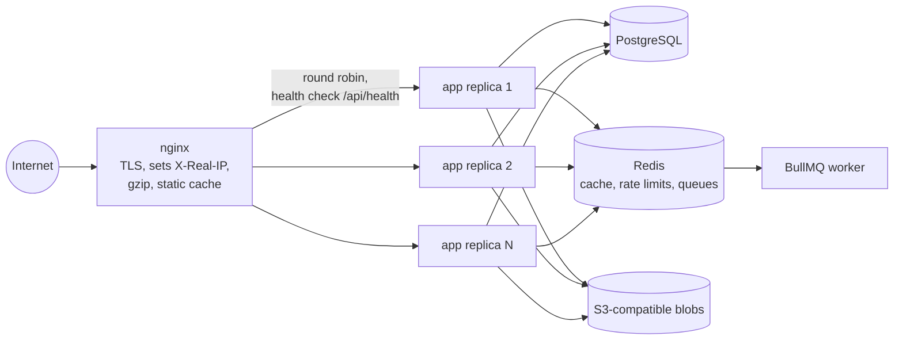

# 9. Load balancing and horizontal scaling

Vertical scaling buys a bigger machine. Horizontal scaling runs more copies of the app behind a load balancer. It only
works if the copies are **stateless**: any replica can serve any request because the state lives elsewhere.

## Today: one replica

`infra/docker-compose.yml` runs one `app` container behind a TLS reverse proxy the owner provides. Before adding a
second replica, check every piece of state the process holds:

| State | Where it lives today | Shared across replicas? | Needed for 2+ replicas |
|-------|----------------------|-------------------------|------------------------|
| User sessions | Sealed cookie in the browser (`nuxt-auth-utils`) | Yes, nothing on the server | Nothing: every replica has `NUXT_SESSION_PASSWORD` |
| Database | PostgreSQL (`DATABASE_URL`) | Yes | Nothing (SQLite would not work: a local file) |
| Uploads and digital files | `fs` blob driver on the `app-data` volume (`/app/.data`) | **No** | S3-compatible storage, or one shared volume ([docs/infra-and-setup.md](../infra-and-setup.md#uploads-in-the-docker-image)) |
| Global and per-route rate limits | nuxt-security limiter, in process memory | **No** | Shared storage (Redis); otherwise N replicas allow N × the limit |
| Per-token API limit (120/min) | `Map` in `server/utils/auth.ts` | **No** | Shared storage (Redis); listed in docs/security.md residual risks |
| Stripe webhook idempotency | `stripe_events` table | Yes | Nothing: two replicas receiving the same event race safely (conditional updates + idempotency keys) |
| Cache | None yet | n/a | Redis when added ([07-caching.md](07-caching.md)) |

Sessions and money are already replica-safe, by design. Rate limits and local uploads are not. That table is the
checklist PLAN.md Phase 21 works through.

## Planned: nginx in front of 2+ replicas (Phase 21)

> **Planned (Phase 21).** Described design only, not in the code. See PLAN.md Phase 21.

The plan, as written in PLAN.md:

- nginx in docker-compose in front of **2+ app replicas**.
- Health checks against `GET /api/health` (it returns only `{ "status": "ok" }`, `server/api/health.get.ts`).
- nginx **sets `X-Real-IP`**, which the rate limiter keys on (`nuxt.config.ts`), plus gzip and static caching.
- Rate limits move to Redis so replicas share buckets.
- Acceptance: the stack with 2 replicas passes the smoke and QA suites, and works with Redis down (no cache, inline
  jobs).

### Things to get right

- **No sticky sessions needed.** Because the session is a cookie, round robin is enough. That is a direct payoff of
  the stateless session design ([06-auth-and-security.md](06-auth-and-security.md#stateless-sessions)).
- **Liveness vs readiness.** `/api/health` says "the process is up", not "the database is reachable". A replica that
  lost its database still passes, so the balancer keeps sending it traffic. A readiness check that pings the database
  (cheaply, without leaking details) is the usual split.
- **Migrations with N replicas.** Today a one-shot `migrate` container runs before `app`. With rolling deploys, old and
  new code run against the same schema for a while, so migrations must be backward-compatible (add a column, deploy,
  then remove the old one in a later release).
- **Connection budget.** N replicas × pool size ≤ PostgreSQL `max_connections`. Add PgBouncer when N grows.
- **Webhooks hit any replica.** Stripe calls one URL; the balancer picks a replica. Correct because the webhook is
  idempotent through the database, not through process memory.

## Scaling the database

One PostgreSQL instance handles this workload for years ([02-capacity-estimates.md](02-capacity-estimates.md)). The
next steps, in the order a real team would take them:

1. Indexes for the queries that show up in slow-query logs (search is the first candidate: trigram or full-text).
2. Read replicas for the catalog, accepting replication lag on browse pages (never on checkout).
3. Archive cold data: old `stripe_events.payload` rows are the biggest table.
4. Partition `transaction_logs` by month if it grows into the hundreds of millions of rows.

Sharding is not on the list: nothing here comes close to needing it.
