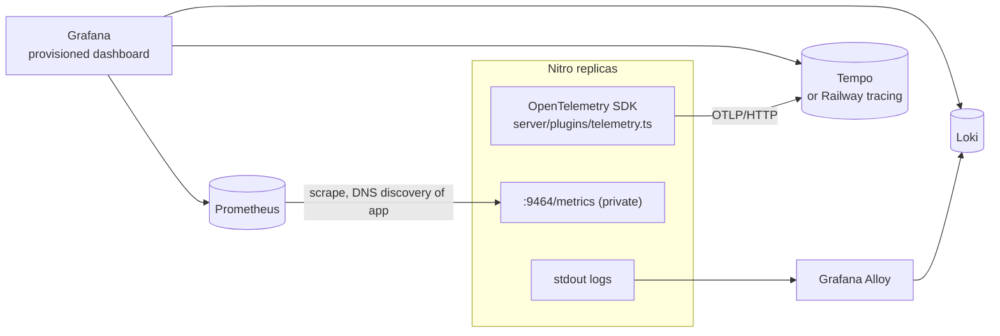

# 10. Observability

Observability answers "what is the system doing right now, and why did that request fail?" The three classic signals
are **logs** (events), **metrics** (numbers over time) and **traces** (one request across components).

## Audit trails in the database

| Signal | What | Where |
|--------|------|-------|
| Money audit trail | One append-only row per money event, filterable and exportable as CSV by admins | `transaction_logs`, `server/utils/transactions.ts`, `/admin/transaction-logs` |
| Admin audit trail | Every moderation change and export, in the same transaction as the change | `audit_logs`, `server/utils/audit.ts` |
| Webhook archive | Every Stripe event received, with `processed_at` | `stripe_events` |
| Readiness | `GET /api/health` → `{ "status": "ok" }`, or 503 when the database query fails; used by the Docker `HEALTHCHECK` and Railway's deploy check | `server/api/health.get.ts`, `infra/docker/Dockerfile` |

## Traces, metrics and logs

[docs/observability.md](../observability.md) is the operating guide. All three signals are optional: the app runs
the same with none of them.

- **Traces.** The OpenTelemetry Node SDK starts from a Nitro plugin, only when `OTEL_EXPORTER_OTLP_ENDPOINT` or
  `OTEL_METRICS_EXPORTER` is set. Spans are created by hand from Nitro's `request`, `afterResponse` and `error`
  hooks, because auto-instrumentation patches Node's `require`, which neither Bun nor a bundled Nitro server goes
  through. One server span per request: it continues an upstream `traceparent` (Railway's edge), is renamed to the
  matched route pattern, records the status code and exceptions. The app exports **straight to Tempo** over
  OTLP/HTTP (no OpenTelemetry Collector), or to Railway tracing in production.
- **Metrics.** With `OTEL_METRICS_EXPORTER=prometheus` each replica serves `:9464/metrics` (not routed through the
  load balancer): the `http.server.request.duration` histogram (method, route pattern, status) and the
  `resell.money_events` / `resell.money_cents` counters, incremented by every `logTransaction()` row. Labels use the
  route pattern (`/api/products/:slug`), never the raw path, to keep cardinality bounded. Prometheus finds every
  replica through Docker DNS (`dns_sd_configs`, type `A`, `infra/observability/prometheus.yml`).
- **Logs.** stdout: Nitro logs, `[redis]` / `[queue]` / `[otel]` lines, and security events as JSON lines
  (`server/utils/security-log.ts`: logins, password resets, CSRF refusals; ids, reason and client IP, never emails,
  passwords or tokens). **Grafana Alloy** tails the containers and ships to **Loki** (Promtail is deprecated and not
  used). Log lines don't carry the trace id yet.
- **Stack.** `infra/docker-compose.observability.yml`, layered on the main compose file: Tempo, Prometheus, Loki,
  Alloy and Grafana (datasources and the "resell.sh — app" dashboard provisioned from `infra/observability/`).

### What to measure in a marketplace

Start from what hurts users and money, not from what is easy to count:

| Signal | Why | Alert when |
|--------|-----|------------|
| Checkout success rate (`checkout.created` → `payment.succeeded`) | The business metric | Drops sharply against the same hour last week |
| `transfer.failed` and `transfer.reversal_failed` count | A seller wasn't paid, or the platform is carrying a loss | Any, ever |
| Webhook handler errors and latency | Stripe retries, then disables the endpoint after repeated failures | Error rate > 0 for 5 minutes |
| p95 latency of `GET /api/products` | Browse speed on Black Friday | Above the target from the load test |
| 429 rate | Real users hitting rate limits (one office behind NAT) | Spikes |
| Mail queue depth and failed-job count (not exported yet) | Work piling up, mail not reaching users | Growing for 10 minutes |

### The trace that teaches the most

A checkout is two requests far apart in time: `POST /api/checkout` and, seconds or minutes later, Stripe's webhook.
They don't share an HTTP trace context. The link is the order id (`metadata.orderId`, `transfer_group`). The spans
don't carry it yet: putting the order id on both as an attribute is what would let you follow one purchase end to
end ([13-exercises.md](13-exercises.md)).
