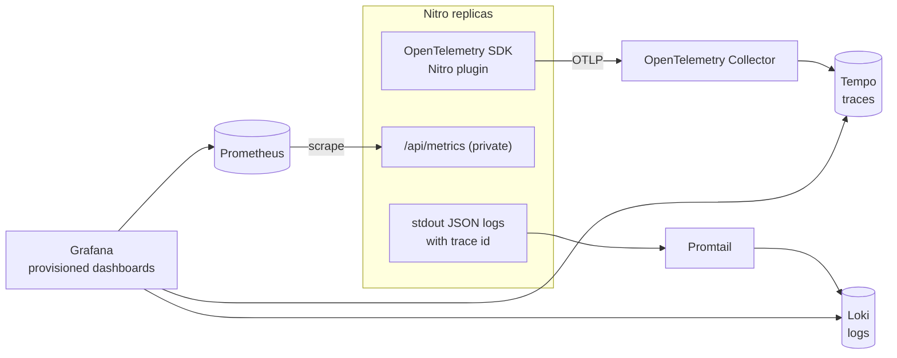

# 10. Observability

Observability answers "what is the system doing right now, and why did that request fail?" The three classic signals
are **logs** (events), **metrics** (numbers over time) and **traces** (one request across components).

## What exists today

| Signal | What | Where |
|--------|------|-------|
| Money audit trail | One append-only row per money event, filterable and exportable as CSV by admins | `transaction_logs`, `server/utils/transactions.ts`, `/admin/transaction-logs` |
| Admin audit trail | Every moderation change and export, in the same transaction as the change | `audit_logs`, `server/utils/audit.ts` |
| Security events | JSON lines on stdout: `login.succeeded/failed`, `password_reset.requested/completed`, `password.changed`, `csrf.refused` (ids, reason, client IP; never emails, passwords or tokens) | `server/utils/security-log.ts` |
| Webhook archive | Every Stripe event received, with `processed_at` | `stripe_events` |
| Liveness | `GET /api/health` → `{ "status": "ok" }`, used by the Docker `HEALTHCHECK` | `server/api/health.get.ts`, `infra/docker/Dockerfile` |
| Errors | `console.error` for swallowed failures (for example `[orders] email failed`) | `server/utils/orders.ts` |

These are good for audits and incident forensics, but there are no metrics, dashboards, traces or alerts yet. Nobody
gets paged when `transfer.failed` rows appear.

## Planned: OpenTelemetry + Prometheus + Grafana + Tempo + Loki (Phase 22)

> **Planned (Phase 22).** Described design only, not in the code. See PLAN.md Phase 22.

The plan, as written in PLAN.md:

- **Traces**: an OpenTelemetry SDK in a Nitro plugin creates spans for HTTP requests, database queries and Stripe
  calls, exported over OTLP. Off when `OTEL_EXPORTER_OTLP_ENDPOINT` is unset.
- **Trace id in logs**, so a log line links to its trace.
- **Metrics** on a private `/api/metrics` for Prometheus: request rate and latency histogram, errors, checkout and
  payment counters, queue depth, cache hits.
- **A docker-compose `observability` profile**: OpenTelemetry Collector, Prometheus, Grafana with provisioned
  dashboards, Tempo for traces, Loki + Promtail for logs.
- **docs/observability.md**: how to read one trace from the buyer's click to the Stripe webhook.

### What to measure in a marketplace

Start from what hurts users and money, not from what is easy to count:

| Signal | Why | Alert when |
|--------|-----|------------|
| Checkout success rate (`checkout.created` → `payment.succeeded`) | The business metric | Drops sharply against the same hour last week |
| `transfer.failed` and `transfer.reversal_failed` count | A seller wasn't paid, or the platform is carrying a loss | Any, ever |
| Webhook handler errors and latency | Stripe retries, then disables the endpoint after repeated failures | Error rate > 0 for 5 minutes |
| p95 latency of `GET /api/products` | Browse speed on Black Friday | Above the target from the load test |
| 429 rate | Real users hitting rate limits (one office behind NAT) | Spikes |
| Queue depth and dead-letter count (once queues exist) | Work piling up | Growing for 10 minutes |

### The trace that teaches the most

A checkout is two requests far apart in time: `POST /api/checkout` and, seconds or minutes later, Stripe's webhook.
They don't share an HTTP trace context. The link is the order id (`metadata.orderId`, `transfer_group`). Putting the
order id on both spans as an attribute is what lets you follow one purchase end to end.
